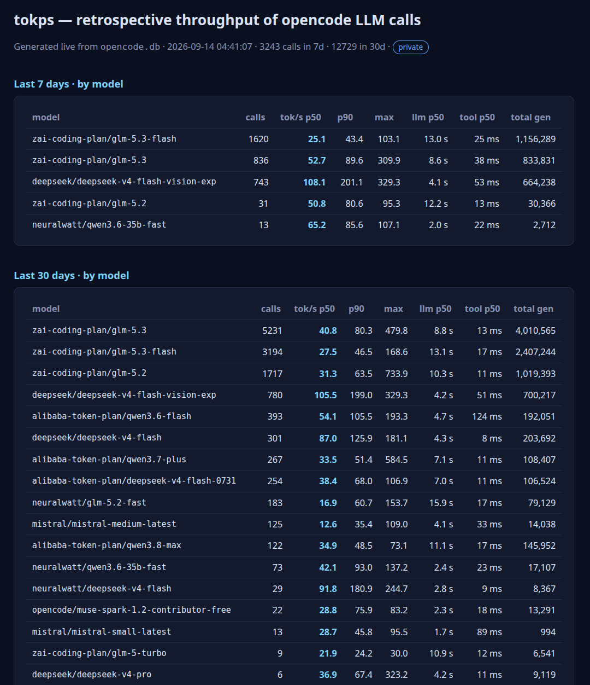

# tokps — retrospective LLM throughput for opencode

A single-file PHP dashboard that shows **how fast your LLM providers really are**
(tokens/s) based on the calls opencode already made — no instrumentation, no
proxies, nothing to install inside opencode.

It reads opencode's own SQLite database (`opencode.db`), where every assistant
message already stores token counts and timestamps, and turns them into
percentile throughput stats per model: last 7 days, last 30 days, daily
activity and the most recent calls.

## What it looks like



Dark, minimal, mobile-friendly: summary tables (p50 / p90 / max tok/s per
model), daily activity, and a tail of the latest calls with tool time and
finish reason. All texts in English, numbers in international format.

## The metric (read this first)

The naive calculation (output tokens ÷ message duration) is **wrong in two
ways**, which we verified empirically against opencode's DB:

1. The `time.created → time.completed` span **includes tool execution**
   (bash/read/MCP... runs at the end of the span, before `completed` is set).
2. **Reasoning tokens dominate** in thinking models — in one sample message,
   3,284 reasoning tokens vs 123 output tokens. Ignoring them underestimates
   the real generation speed by ~2x.

So tokps computes:

```
tok/s = (output + reasoning tokens) / (time.created → first tool start)
```

(or `→ time.completed` for messages with no tools). Tool time is reported as
its own column. The window still includes TTFT and any provider retries —
they cannot be separated retroactively.

## Requirements

- PHP 8.1+ with `pdo_sqlite` (bundled in most distros: `php-sqlite3`)
- opencode (the dashboard reads `~/.local/share/opencode/opencode.db`
  read-only through WAL, so it never blocks a running opencode)

## Setup

```bash
git clone https://github.com/YOU/tokps.git && cd tokps
cp .env.php.example .env.php
# edit .env.php: set the absolute path to your opencode.db
php -S localhost:8080        # or point nginx/Apache at the directory
```

Open `http://localhost:8080` — done. On first load it queries the DB
(~1–2 s for tens of thousands of messages); afterwards every request is
served from the HTML page cache until the TTL expires.

### Configuration (`.env.php`)

| key         | meaning                                                        |
|-------------|----------------------------------------------------------------|
| `db`        | absolute path to your `opencode.db`                            |
| `cache_dir` | HTML cache directory, created automatically. Keep it **writable by the PHP user**; on publicly served hosts prefer a path outside the docroot |
| `ttl`       | cache TTL in seconds (default 300)                             |

If the cache directory is not writable, the app degrades gracefully to
live queries (slower, but works).

### Serving it publicly

The page itself contains no secrets (anonymous throughput stats), but:

- **Deny dotfiles** on your webserver (`.env.php` must never be served).
  With nginx: `location ~ /\. { return 404; }`
- Use the cache + a `Cache-Control` header if the link may receive traffic
  spikes (tokps already sends `Cache-Control: public, max-age=<ttl>`).
- Optional: gate `?refresh=1` (forces cache regeneration) to trusted IPs.

## CLI companion

`tokps.py` (Python 3, stdlib only) gives you the same metrics in the
terminal, including per-message forensics:

```bash
./tokps.py                  # summary per model, last 7 days
./tokps.py --days 30        # wider window
./tokps.py --session ses_xxx [--min-out 0]   # message-by-message detail
./tokps.py --jsonl          # machine-readable dump
```

## Files

```
index.php          the whole app (dashboard + page cache)
tokps.py           forensic CLI
.env.php.example   configuration template → copy to .env.php
```

## License

MIT — do whatever you want, attribution appreciated.
